# OpenSSH Proxy

##### tags: `WayneCW_Chen` `StudyGroup` `Networking`

## 前言
本次因 Working From Home 須使用公司配發之機器經由 GlobalProtect VPN 連線，如果使用自己原有的工作機器則難以連至機房。將兩者連線後，有幾種方式可以使原有機器藉由公司機器的 VPN 網路連至機房：
1. ssh chaining：經多次 ssh 連線至機房
2. port forwarding：將部份機房服務的 IP 與 Port 列出，一一在本地建立 Port 的映射
3. proxy：建立 proxy server，讓本地的網路流量都經過 proxy

本次使用 OpenSSH Server 做為跳板或 SOCKS Proxy Server，因為
1. 不需要在跳板機上安裝未被公司認證的第三方的軟體，直接透過 Windows 設定來安裝
2. 不用條列並逐一的 Port Forward
3. 可直接使用原有 IP 來操作所有網頁服務 (以及大部分其他 tcp 服務)

**經測試如使用手機網路連線可能導致 ssh 相關問題，建議使用路由器連接跳板機與工作機。**

## 環境
1. 跳板機：一台公司發的 Windows 10 機器，設定好了使用者與帳戶以及 Global Protect VPN
2. 工作機：另一台自己辦公使用的電腦

將兩者連在同一個網路底下，將跳板機先連好 Global Protect VPN。

本篇使用的IP：<br>
* 跳板機：192.168.2.105

## 跳板機設置

### OpenSSH Server
安裝參考此 [blog](http://benjr.tw/103097) 前段。

1. 開啟 Windows 設定，找到應用程式 (Apps)

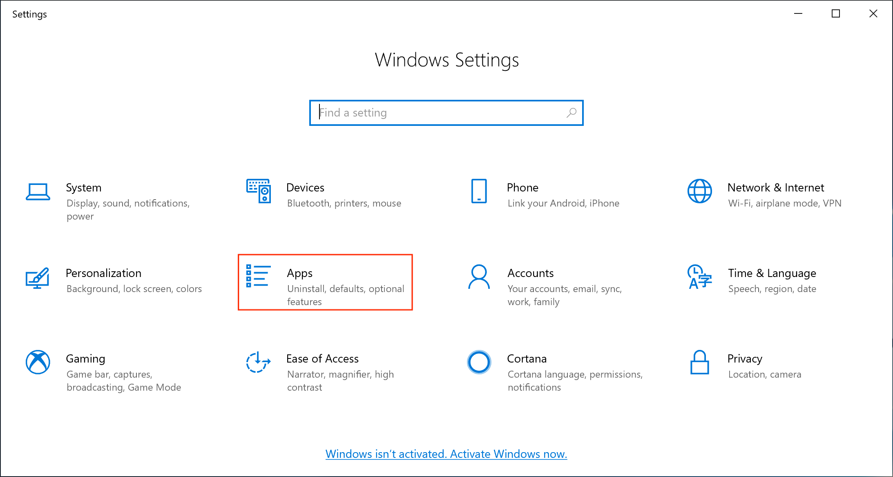

2. 選用功能 (Manage optional features)

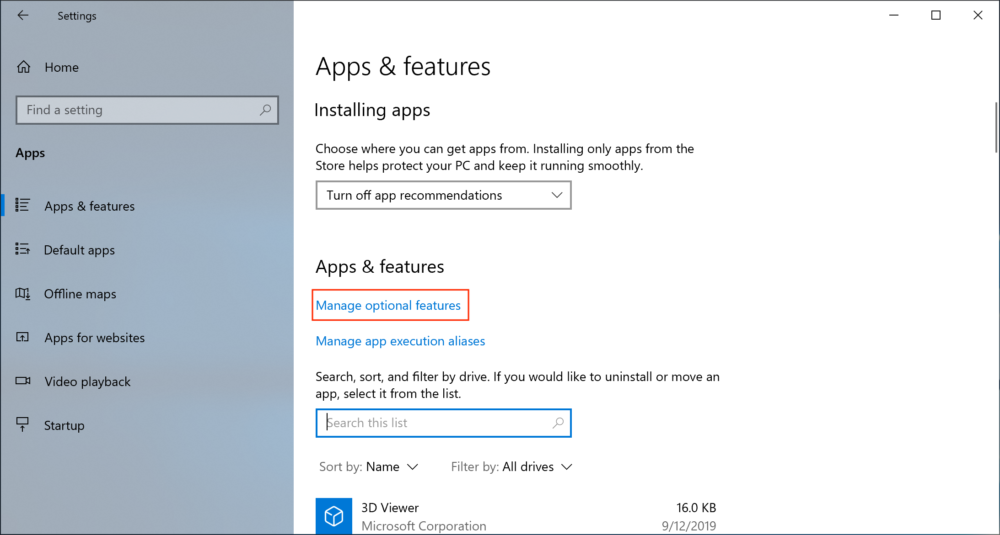

3. 新增功能 (Add a feature)

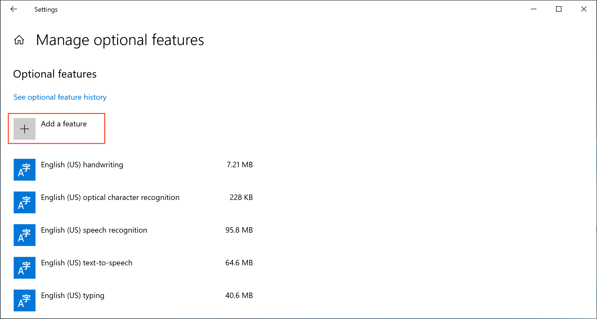

4. 搜尋到並安裝 OpenSSH 伺服器 (OpenSSH Server)

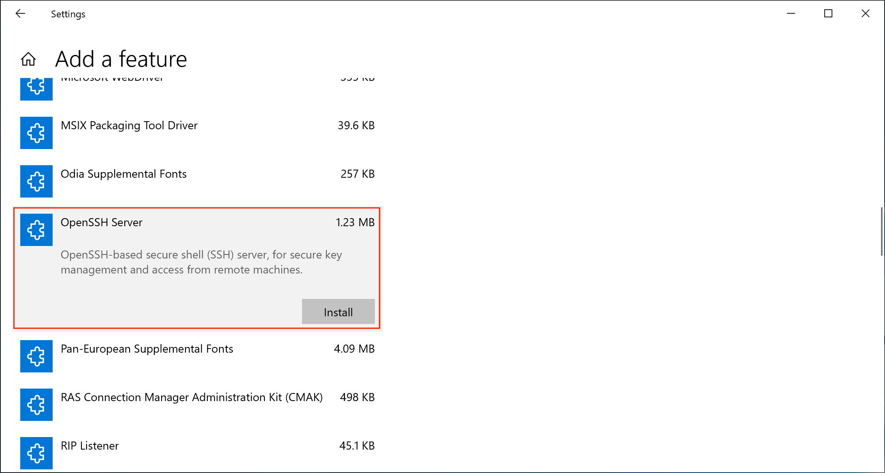

至此已經安裝完畢。

### (選用) Windows Terminal
單純方便使用系統管理員權限之 Powershell，可以不安裝。

打開 Microsoft Store 尋找 Windows Terminal，選擇第一個安裝並啟動。

### 開啟 OpenSSH Server
開啟擁有系統管理員權限之 Powershell，輸入：

```
PS C:\Users\waynecw_chen> Get-Service sshd

Status   Name           DisplayName
------   ----           -----------
Stopped  sshd           OpenSSH SSH Server
```

如果狀態不是 Running，開啟 sshd：

```
PS C:\Users\waynecw_chen> Start-Service sshd
PS C:\Users\waynecw_chen> Get-Service sshd

Status   Name           DisplayName
------   ----           -----------
Running  sshd           OpenSSH SSH Server
```

完成後確認 Global Protect VPN 已經開啟，並測試連線：

```
PS C:\Users\waynecw_chen> ssh localhost
asus\waynecw_chen@localhost's password:   # OA 密碼

Microsoft Windows [版本 10.0.19042.985]
(c) Microsoft Corporation. 著作權所有，並保留一切權利。

asus\waynecw_chen@LG-UX331UAL-01 C:\Users\waynecw_chen>

```

如果沒有開啟 Global Protect 的話，Port 22 會被擋 (目前不知道為何)：

```
PS C:\Users\waynecw_chen> ssh localhost
Connection reset by ::1 port 22
```

如果還是無法連線，可以考慮安裝完重開機後再做嘗試。

## 工作機設置

### 最佳方案
經測試，因不同的作業系統有不同的最佳方案：

| OS           | 方法                        |
|--------------|-----------------------------|
| Windows      | **SOCKS Proxy + Proxifier** |
| Mac          | **sshuttle (w/ ssh -J)**    |
| Linux/WSL/VM | **sshuttle (w/ ssh -J)**    |

### 各個方案支援程度

|                             | 沿用IP | Browser<br>(網頁) | ssh/git/<br>curl | docker/<br>k9s | 來源與費用        | 支援系統             |
|-----------------------------|--------|-------------------|------------------|----------------|-------------------|----------------------|
| **1. sshuttle (w/ ssh -J)** | **V**  | **V**             | **V**            | **V**          | **開源免費**      | **Mac, Linux, WSL2** |
| 以下皆含 SOCKS Proxy        |        |                   |                  |                |                   |                      |
| **2. + Proxifier**          | **V**  | **V**             | **V**            | **V**          | 商業<br>31 天試用 | **Windows**, (Mac?)  |
| 3. + proxychains + sshuttle | **V**  | **V**             | **V**            | **V**          | **開源免費**      | Linux, WSL2, (Mac)   |
| 4. + proxychains            | **V**  | O<br>(設 proxy)   | O<br>(額外程式)  | x              | **開源免費**      | Linux, WSL2, (Mac)   |
| 5. SOCKS Proxy only         | **V**  | O<br>(設 proxy)   | curl<br>(設 env) | x              | **開源免費**      | ALL                  |

> **V：與過去操作完全相同**；O：使用當下需要額外設定；x：不支援

### 網路架構比較
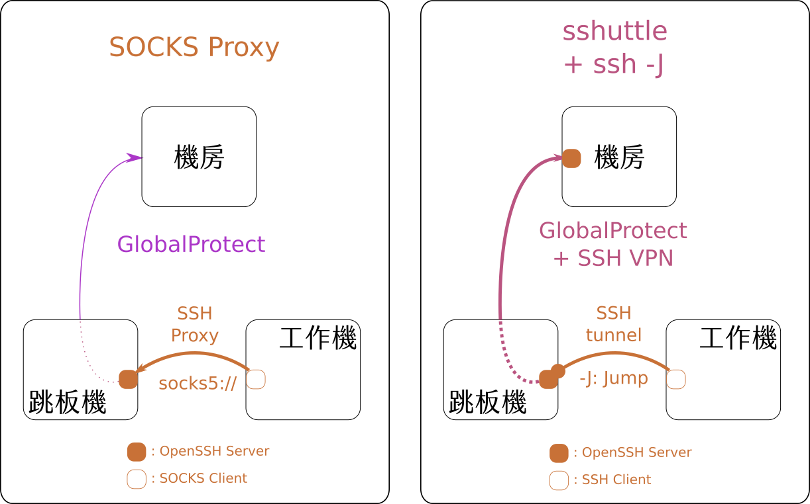

兩者的差異在於 SSH 的使用方式及 SSH 通道結束的位置。
1. SOCKS Proxy: 跳板機作為 Proxy Server。<br>
   發送的封包在跳板機上離開 SSH，循跳板機原本的 Global Protect 連至機房。
2. sshuttle: 跳板機作為跳板，用 SSH 對機房機器搭建 VPN。<br>
   發送的封包經過跳板機，透過 GlobalProtect + SSH 通道，直到機房了才離開 SSH。

雖然架構上不同，但是對於使用者感受上沒有什麼差別。

### SOCKS Proxy
網路拓普請見：[網路架構比較](#網路架構比較)

#### 安裝 SSH Client
使用一個自己習慣的 SSH Client，需要有支援 SOCKS Proxy，已知下列的軟體可以使用：
* Windows: OpenSSH Client, Putty or MobaXTerm
* Mac & Linux: OpenSSH Client

#### 開啟 SOCKS Proxy 通道
本次用工作機以 OpenSSH Client 連線，並以 Port 9050 當作範例。

如果可以成功 SSH 則會看到以下：
```
$ ssh -D 9050 waynecw_chen@192.168.2.105

Microsoft Windows [版本 10.0.19042.985]
(c) Microsoft Corporation. 著作權所有，並保留一切權利。

asus\waynecw_chen@LG-UX331UAL-01 C:\Users\waynecw_chen>
```

確認可以成功後先切斷連線，以後可以使用下列指令：

```
$ ssh -D 9050 -N -q waynecw_chen@192.168.2.105

```

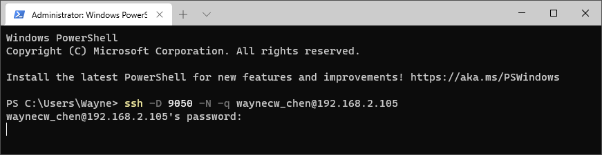

指令會 hang 住，此時應已經建立通道，請放著不要中斷指令，`Ctrl+C` 即關閉通道。

#### 以瀏覽器驗證 SOCKS Proxy
打開瀏覽器，本次以 Firefox 為例，每個瀏覽器應該都可以設定 Proxy 的功能。開啟 Firefox 的設定，捲到最下方：

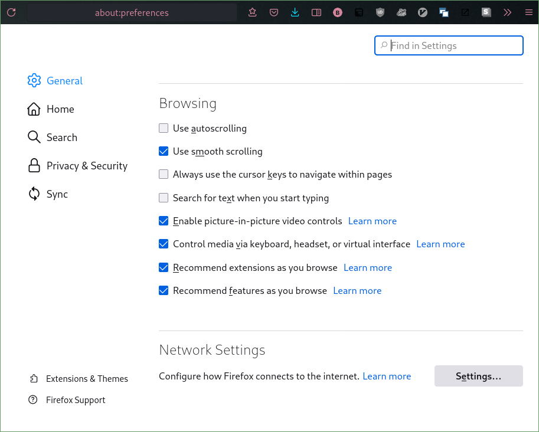

點選 Network Settings 的 `Settings...`，選 Manual proxy configuration。<br>
在 SOCKS Host 的部份填入 `localhost`， Port 9050：

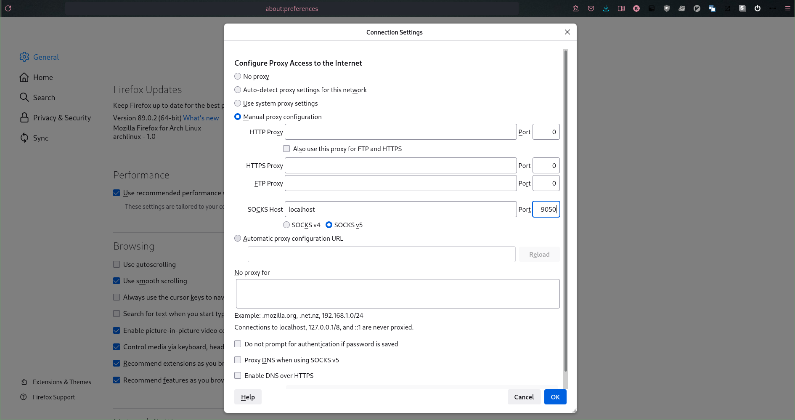

完成後點選 OK。至此已經將 SOCKS Proxy 設置完畢，瀏覽器的流量應已經透過 SOCKS Proxy，<br>
可以連線至機房內部的服務，如 Gitlab：http://10.78.26.44:30000

在使用後續的 [Proxy Client](#以-proxy-client-使用-socks-proxy) 前，請將這個 Proxy 的設置取消，並改回沿用系統的 Proxy 設定。


##### (選用) Proxy Toggle
如果網路已經設定 SOCKS Proxy，但是通道卻不存在時，所有網頁都會無法瀏覽，所以有時候會想要快速切換瀏覽器是否使用 SOCKS Proxy。<br>
可以查看看瀏覽器是否有插件支援一鍵開啟/關閉 Proxy，如 Firefox 的 [Proxy Toggle](https://addons.mozilla.org/zh-TW/firefox/addon/proxy-toggle/)。

#### 以 Terminal 驗證 SOCKS Proxy
使用 Terminal 時有兩種方法可以指定 SOCKS Proxy:
1. 使用環境變數如 http_proxy 或 all_proxy
2. 使用應用程式如 proxychains, tsocks 或 Proxifier


##### 以環境變數使用 SOCKS Proxy
使用上很簡單，就是先 export all_proxy 或者 http_proxy 變數：

```
# export http_proxy="socks5://localhost:9050"
# curl 10.78.26.44:30000
<html><body>You are being <a href="http://10.78.26.44:30000/users/sign_in">redirected</a>.</body></html>%
```

不過本方法對於某些指令並不能生效，如 ssh 與 git。

### 以 Proxy Client 使用 SOCKS Proxy
本次使用的 Proxy Client 有兩種
1. Proxifier
2. proxychains 或 tsocks

Windows 只支援第一種，而經實驗其他作業系統可以使用 sshuttle，不再需要使用 proxychains / tsocks，故在此先介紹 Proxifier。

#### Proxifier
[Proxifier](https://www.proxifier.com/) 是一個付費軟體，有提供 31 天免費試用。本次使用此試用版本。<br>
安裝非常簡單就不在此敘述。

安裝完 Proxifier 後開啟，選擇下圖所示的 Proxy Servers：<br>
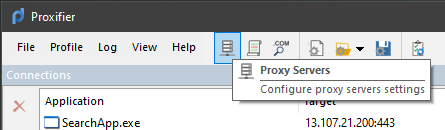

按照先前建立的 SOCKS Proxy，填入 Proxy Server 設定：<br>
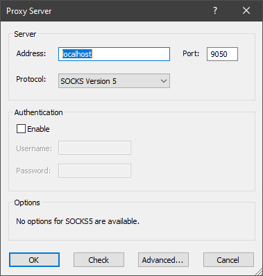

設定完成的同時即生效，可從瀏覽器或命令列直接測試，流量會在 Proxifier 中顯示。<br>
需停用 Proxy 時，選擇 File -> exit 即可。

#### Proxychains
經測試其他作業系統可以使用 sshuttle，故 proxychains 部份僅留供參考。

> 本次使用 proxychains，依照自己環境的套件管理系統安裝後，執行 SSH 指令：
> 
> ```
> $ ssh -i ~/ocis/.ssh/id_rsa WayneCW_Chen@10.78.26.200
> ssh: connect to host 10.78.26.200 port 22: No route to host
> $ proxychains ssh -i [keyfile] WayneCW_Chen@10.78.26.200 # 自己帶入自己的 key
> [proxychains] config file found: /etc/proxychains.conf
> [proxychains] preloading /usr/lib/libproxychains4.so
> [proxychains] DLL init: proxychains-ng 4.14
> [proxychains] Strict chain  ...  127.0.0.1:9050  ...  10.78.26.200:22  ...  OK
> Welcome to Ubuntu 20.04.1 LTS (GNU/Linux 5.9.16-050916-generic x86_64)
> 
>  * Documentation:  https://help.ubuntu.com
>  * Management:     https://landscape.canonical.com
>  * Support:        https://ubuntu.com/advantage
> 
>   System information as of Fri 25 Jun 2021 09:34:40 PM UTC
> 
>   System load:  1.96             Processes:                        730
>   Usage of /:   1.1% of 7.22TB   Users logged in:                  0
>   Memory usage: 3%               IPv4 address for br-728b0becea23: 192.168.32.1
>   Swap usage:   0%               IPv4 address for docker0:         172.17.0.1
>   Temperature:  33.0 C           IPv4 address for tunl0:           10.168.2.64
> 
>  * Super-optimized for small spaces - read how we shrank the memory
>    footprint of MicroK8s to make it the smallest full K8s around.
> 
>    https://ubuntu.com/blog/microk8s-memory-optimisation
> 
> 123 updates can be installed immediately.
> 0 of these updates are security updates.
> To see these additional updates run: apt list --upgradable
> 
> 
> *** System restart required ***
> Last login: Fri Jun 25 21:34:32 2021 from 10.80.144.154
> WayneCW_Chen@cloudinfra-stg-master02:~$ logout
> Connection to 10.78.26.200 closed.
> ```
> 
> 如果不是單一指令，想要所有指令都生效的話，可以用 proxychains 開啟新的 Terminal：
> 
> ```
> proxychains alacritty  # 請將 alacritty 更換成你的 terminal emulator (如 gnome-terminal, iterm2 等)
> ```
> 之後新的 Terminal 內的指令都會自動帶入 SOCKS Proxy。 


### Sshuttle
網路拓普請見：[網路架構比較](#網路架構比較)

[sshuttle](https://github.com/sshuttle/sshuttle) 是一套透過 SSH 建立 VPN 功能的 Python 程式，在 Mac 與 Linux (及其衍生的 VM 或 WSL) 環境可以執行。

開始之前準備以下資訊：
1. 使用的額外需求是：<br>
   **在機房內部必須有一台可以 SSH 登入的機器** ，<br>
   我們要將它設定為去機房的網路流量出口。
2. 登入機器 IP, 使用者與所需的 SSH key
3. 跳板機的 IP
4. 機房涵蓋的網段 (至少要 10.78.26.0/24)

#### 安裝
在工作機上，安裝的部份按照 [Github 頁面](https://github.com/sshuttle/sshuttle) 即可。

#### 開啟 Sshuttle

安裝完之後執行

```
sshuttle --dns -r [機房機器使用者]@[機房機器IP] 10.78.26.0/24 --ssh-cmd 'ssh -J [OA 帳號]@[跳板機IP] -i [機房機器 SSH key]'
```

一個實際的例子是：

```
$ sshuttle --dns -r waynecw_chen@10.78.26.165 10.78.26.0/24 --ssh-cmd 'ssh -J waynecw_chen@192.168.2.105 -i [keyfile]'
c : Connected to server.
```

指令會 hang 住，此時應已經建立通道，請放著不要中斷指令；`Ctrl+C` 即關閉通道。

此時機房網頁服務與相關指令應皆可直接使用，目前觀察到的例外是 `ping`，可能與其不使用 tcp 有關。


## 瀏覽公司內部網站

如果有使用公司內部網站 (如 eip 等) 的需求，可以依照以下方法設置

### 透過 Proxifier
打開 Name Resolution 的設定：<br>
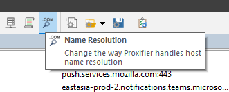

取消 "Detect DNS settings automatically"，選用 "Resolve hostnames through proxy"：<br>
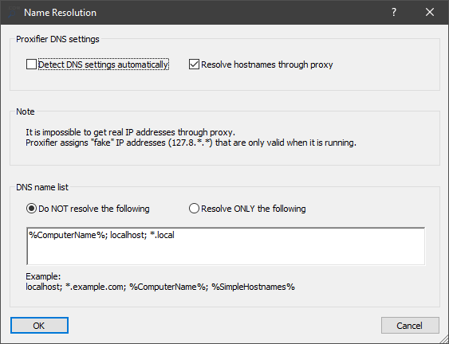

再點選 OK 即可。有客製化的需求可以使用圖中 "DNS name list" 來達到黑名單或白名單的功能。

### 透過 Sshuttle

可以更改 IP 的範圍變成全部的流量：
```
sshuttle --dns -r [機房機器使用者]@[機房機器IP] 0.0.0.0/0 --ssh-cmd 'ssh -J [OA 帳號]@[跳板機IP] -i [機房機器 SSH key]'
```

如果只想將部份網段流量導至 sshuttle，可以在上面指令運行的狀態下，將各項網頁服務所屬的 IP 查出 (如 `nslookup eip.asus.com`)，再將其主要網段加入原有的指令，修改為：
```
sshuttle --dns -r [機房機器使用者]@[機房機器IP] 10.78.26.0/24 172.20.168.0/23 --ssh-cmd 'ssh -J [OA 帳號]@[跳板機IP] -i [機房機器 SSH key]'
```

## 結語

做完本系列測試後恰巧看到一篇 [Guide](https://posts.specterops.io/offensive-security-guide-to-ssh-tunnels-and-proxies-b525cbd4d4c6)，正巧涵蓋了本次幾乎所有的使用情境與工具，也介紹了 SSH 在 Port Forwarding 與 Proxy 上、從基礎到延伸的使用方式，對本主題有興趣的人可以當作延伸閱讀。

## Ref
1. OpenSSH Server 安裝：http://benjr.tw/103097
2. man ssh<br>
>     -D [bind_address:]port
>             Specifies a local “dynamic” application-level port forwarding.  This
>             works by allocating a socket to listen to port on the local side, op‐
>             tionally bound to the specified bind_address.  Whenever a connection is
>             made to this port, the connection is forwarded over the secure channel,
>             and the application protocol is then used to determine where to connect
>             to from the remote machine.  Currently the SOCKS4 and SOCKS5 protocols
>             are supported, and ssh will act as a SOCKS server.  Only root can for‐
>             ward privileged ports.  Dynamic port forwardings can also be specified
>             in the configuration file.
>
>             IPv6 addresses can be specified by enclosing the address in square
>             brackets.  Only the superuser can forward privileged ports.  By default,
>             the local port is bound in accordance with the GatewayPorts setting.
>             However, an explicit bind_address may be used to bind the connection to
>             a specific address.  The bind_address of “localhost” indicates that the
>             listening port be bound for local use only, while an empty address or
>             ‘*’ indicates that the port should be available from all interfaces.
>
>     ...
>
>     -J destination
>             Connect to the target host by first making a ssh connection to the jump
>             host described by destination and then establishing a TCP forwarding to
>             the ultimate destination from there.  Multiple jump hops may be speci‐
>             fied separated by comma characters.  This is a shortcut to specify a
>             ProxyJump configuration directive.  Note that configuration directives
>             supplied on the command-line generally apply to the destination host and
>             not any specified jump hosts.  Use ~/.ssh/config to specify configura‐
>             tion for jump hosts.

3. SOCKS Proxy：https://zh.wikipedia.org/zh-tw/SOCKS
4. Proxy Toggle：https://addons.mozilla.org/zh-TW/firefox/addon/proxy-toggle/
5. Proxifier：https://www.proxifier.com/
6. Proxychains：https://github.com/rofl0r/proxychains-ng
7. tsocks：http://tsocks.sourceforge.net/
8. sshuttle：https://github.com/sshuttle/sshuttle
9. SSH tunnels and proxies: https://posts.specterops.io/offensive-security-guide-to-ssh-tunnels-and-proxies-b525cbd4d4c6
